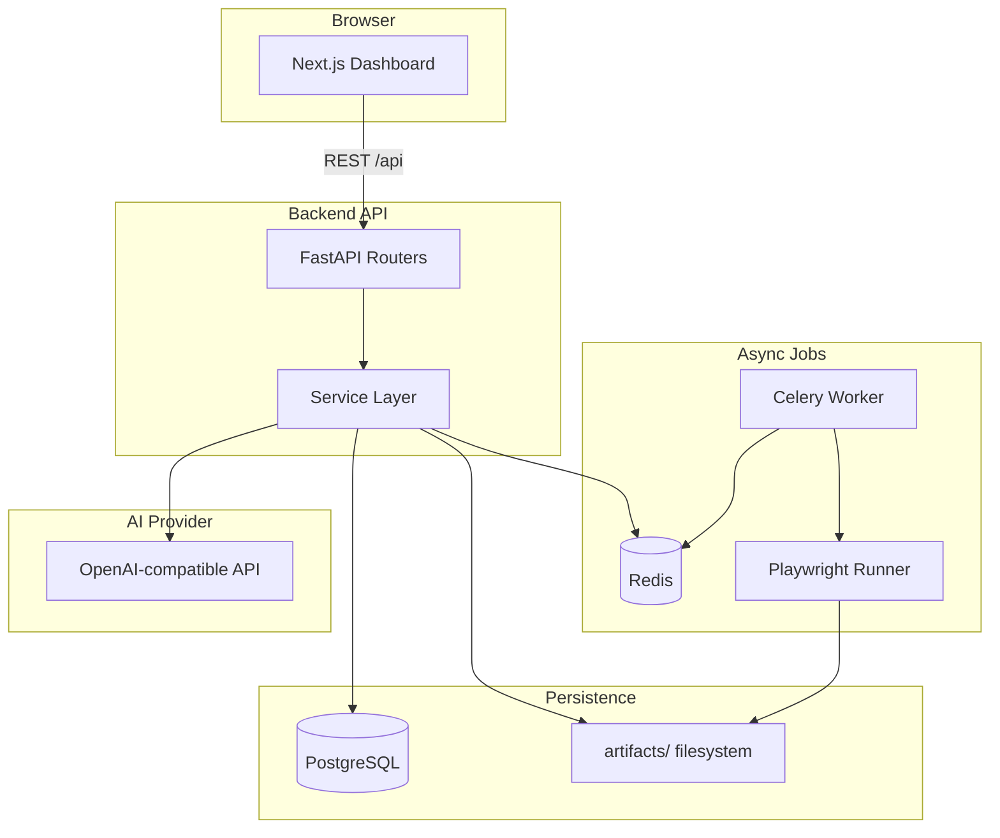

# AutoQA Agent

AI autonomous testing platform that discovers web apps, infers user flows, generates Playwright tests, runs them, captures artifacts, and summarizes failures with AI-powered selector healing suggestions.

> **Open source v1.0** — Self-host and experiment freely. This is an MVP intended for local development and private deployments. It is **not hardened for public internet production** out of the box. See [Self-hosting notes](#self-hosting-notes) before exposing it beyond localhost.

## Overview

AutoQA Agent is an open-source monorepo for developers, QA engineers, and small teams who want to automate test discovery and maintenance without standing up a full enterprise QA suite.

**Core capabilities:**
- Authenticated discovery crawl with domain allowlisting
- Flow inference from crawl graph (login, dashboard, navigation, CRUD, logout)
- Playwright test generation and export
- Manual and scheduled test execution with screenshots, traces, and logs
- AI failure summaries (OpenAI-compatible API)
- Selector healing suggestions with explicit approve/reject flow
- Multi-project workspace with teams and role-based access
- Visual regression testing
- Parallel test execution and Celery worker farm

## Architecture



## Stack

| Layer | Technology |
|-------|------------|
| Frontend | Next.js, TypeScript, Tailwind CSS, React Query, React Flow |
| Backend | FastAPI, Python 3.12, SQLAlchemy, Pydantic |
| Jobs | Celery, Redis, Playwright |
| Database | PostgreSQL |
| Artifacts | Local filesystem (`artifacts/`) |
| AI | OpenAI-compatible chat completions (structured JSON) |
| DevOps | Docker Compose, GitHub Actions |

## Monorepo Structure

```
QABot/
  frontend/          # Next.js dashboard
  backend/           # FastAPI API + Celery tasks
  runner/            # Playwright crawl, spec generation, execution
  artifacts/         # Runtime screenshots, traces, generated specs
  .github/workflows/ # CI pipeline
  docker-compose.yml
  .env.example
```

## Quick Start

### Prerequisites
- Docker and Docker Compose
- (Optional) OpenAI API key for AI features

### Setup

1. Clone the repository:
   ```bash
   git clone https://github.com/rishavsunny12/QABot.git
   cd QABot
   ```

2. Copy environment file and generate secrets:
   ```bash
   cp .env.example .env
   python -c "from cryptography.fernet import Fernet; print(Fernet.generate_key().decode())"
   # Paste the output into CREDENTIALS_ENCRYPTION_KEY and set a random JWT_SECRET
   ```

3. (Optional) Set `OPENAI_API_KEY` in `.env` for AI test titles, failure summaries, and healing rationale.

4. Start all services:
   ```bash
   docker compose up --build
   ```

5. Open the dashboard:
   - **Frontend:** http://localhost:3000
   - **API docs:** http://localhost:8000/docs
   - **Adminer (dev DB UI):** http://localhost:8080 — local dev only, do not expose publicly

### First login

On first visit you will be redirected to **Sign in**. With default `AUTH_MODE=dev`, enter any email and name to create a session. For SSO, set `AUTH_MODE=oidc` and configure the OIDC variables (see below).

### Demo Walkthrough

1. Sign in at http://localhost:3000/login

2. Go to **Project Setup** and create a project using the demo app:
   - Base URL: `https://demo.playwright.dev/todomvc`
   - Allowed domains: `demo.playwright.dev`

3. Click **Start Discovery Crawl** and wait for completion on the **Discovery** page.

4. Open **Flow Map** to see inferred flows and click **Generate All Tests**.

5. Go to **Test Catalog** and click **Run All Tests**.

6. Check **Run History** for results; open failures to see AI summaries and healing suggestions.

## Environment Variables

| Variable | Description |
|----------|-------------|
| `DATABASE_URL` | PostgreSQL connection string |
| `REDIS_URL` | Redis URL for Celery |
| `CREDENTIALS_ENCRYPTION_KEY` | Fernet key for encrypting stored passwords (**required**, generate your own) |
| `AUTH_MODE` | `dev` (email login), `oidc` (SSO), or `disabled` (tests only) |
| `JWT_SECRET` | Secret for session tokens (**required**, use a long random string) |
| `FRONTEND_URL` | Frontend origin for CORS and secure cookies |
| `OIDC_*` | OpenID Connect settings when `AUTH_MODE=oidc` |
| `BILLING_ENABLED` | `false` in v1 OSS (billing ships in v2) |
| `OPENAI_API_KEY` | OpenAI (or compatible) API key |
| `OPENAI_BASE_URL` | API base URL (default: OpenAI) |
| `OPENAI_MODEL` | Model name (default: gpt-4o-mini) |
| `ARTIFACTS_DIR` | Artifact storage path |
| `CRAWL_MAX_PAGES` | Max pages per crawl (default: 50) |
| `CRAWL_MAX_DEPTH` | Max crawl depth (default: 3) |
| `DEFAULT_PARALLEL_WORKERS` | Default concurrent browsers per run (default: 4) |
| `MAX_PARALLEL_WORKERS` | Upper limit for project parallel setting (default: 8) |
| `NEXT_PUBLIC_API_URL` | Frontend → backend API URL |
| `NEXT_PUBLIC_BILLING_ENABLED` | Show billing UI (`false` in v1) |

## How It Works

### Discovery Crawl
Playwright opens the target app, optionally logs in, and performs a domain-restricted BFS crawl. For each page it captures links, buttons, forms, inputs, headings, candidate selectors, and screenshots.

### Flow Inference
Rule-based heuristics analyze the crawl graph to detect common flows: login, dashboard, navigation, create item, and logout.

### Test Generation
Flows are converted into Playwright `.spec.ts` files. AI optionally enhances test titles and assertions.

### Test Execution
Tests are queued via Celery and executed by the Playwright runner. **Local parallel mode** runs specs concurrently in one worker; **browser farm mode** fans out each test to Celery workers (`docker compose up --scale worker=3`).

### Selector Healing
When selector drift is detected, alternatives are ranked from crawl history. Suggestions require explicit user approval before updating specs.

### Authentication & Teams
Projects belong to teams with roles (`viewer`, `member`, `admin`, `owner`). Configure OIDC for production SSO with `AUTH_MODE=oidc`.

## Self-hosting notes

Before exposing AutoQA beyond a trusted network:

1. **Rotate all secrets** — never use `.env.example` defaults in shared environments.
2. **Set `AUTH_MODE=oidc`** (or restrict dev login to a private network).
3. **Remove Adminer** from compose or bind it to localhost only.
4. **Do not publish** Postgres (5432) or Redis (6379) ports to the internet.
5. **Add TLS** via a reverse proxy and set `FRONTEND_URL=https://...`.
6. **Treat this as an MVP** — no built-in backups, monitoring, or payment processing in v1.

Billing and usage metering code exists behind `BILLING_ENABLED=true` for a future v2 release.

## API Endpoints

- `POST /api/auth/dev-login` — Dev sign-in (when `AUTH_MODE=dev`)
- `GET /api/auth/me` — Current user and teams
- `POST /api/projects` — Create project
- `POST /api/projects/{id}/crawl` — Start crawl
- `POST /api/projects/{id}/generate-tests` — Generate Playwright tests
- `POST /api/projects/{id}/run-tests` — Execute tests
- `GET /api/runs/{id}/results` — Get run results
- `GET /api/results/{id}/healing-suggestions` — List healing suggestions

Full API docs at `/docs` when the backend is running.

## Development

### Backend
```bash
cd backend
pip install -e ".[dev]"
pip install -e ../runner
uvicorn app.main:app --reload
```

### Worker & Beat
```bash
celery -A app.tasks.celery_app worker --loglevel=info
celery -A app.tasks.celery_app beat --loglevel=info
```

Or use Docker Compose which starts `worker` and `beat` automatically.

### Frontend
```bash
cd frontend
npm install
npm run dev
```

### Tests
```bash
pytest backend/tests runner/tests -v
```

## Roadmap

### v1.0 (this release)
- [x] Multi-project workspace UI
- [x] Scheduled test runs
- [x] Visual regression testing
- [x] Browser farm / parallel execution
- [x] Enterprise SSO and team roles (OIDC + dev login)

### v2.0 (planned)
- [ ] Billing and usage metering (Stripe)
- [ ] Production compose profile and Alembic migrations
- [ ] Deep health checks and observability hooks

## License

MIT — see [LICENSE](LICENSE).
