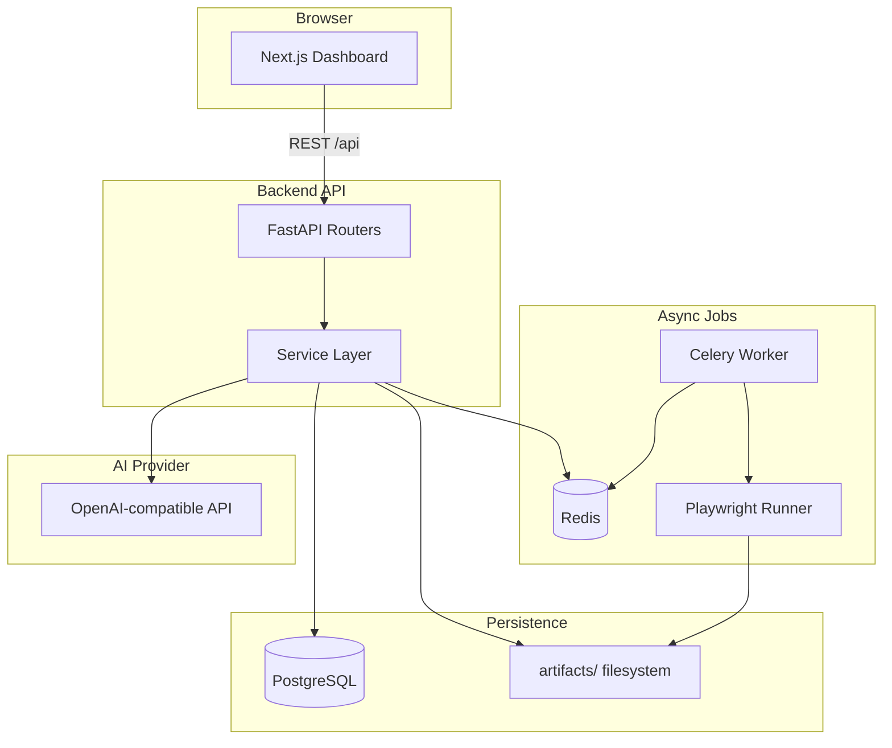

# AutoQA Agent

AI autonomous testing platform that discovers web apps, infers user flows, generates Playwright tests, runs them, captures artifacts, and summarizes failures with AI-powered selector healing suggestions.

## Overview

AutoQA Agent is an MVP monorepo for developers, QA engineers, and small teams who want to automate test discovery and maintenance without standing up a full browser farm or enterprise QA suite.

**Core capabilities:**
- Authenticated discovery crawl with domain allowlisting
- Flow inference from crawl graph (login, dashboard, navigation, CRUD, logout)
- Playwright test generation and export
- Manual test execution with screenshots, traces, and logs
- AI failure summaries (OpenAI-compatible API)
- Selector healing suggestions with explicit approve/reject flow

## Architecture



## Stack

| Layer | Technology |
|-------|------------|
| Frontend | Next.js, TypeScript, Tailwind CSS, shadcn-style UI, React Query, React Flow |
| Backend | FastAPI, Python 3.12, SQLAlchemy, Pydantic, Alembic |
| Jobs | Celery, Redis, Playwright |
| Database | PostgreSQL |
| Artifacts | Local filesystem (`artifacts/`) |
| AI | OpenAI-compatible chat completions (structured JSON) |
| DevOps | Docker Compose, GitHub Actions |

## Monorepo Structure

```
autoqa-agent/
  frontend/          # Next.js dashboard
  backend/           # FastAPI API + Celery tasks
  runner/            # Playwright crawl, spec generation, execution
  artifacts/         # Runtime screenshots, traces, generated specs
  .github/workflows/ # CI pipeline
  docker-compose.yml
  .env.example
```

## Quick Start

### Prerequisites
- Docker and Docker Compose
- (Optional) OpenAI API key for AI features

### Setup

1. Clone the repository:
   ```bash
   git clone https://github.com/rishavsunny12/QABot.git
   cd QABot
   ```

2. Copy environment file:
   ```bash
   cp .env.example .env
   ```

3. (Optional) Set `OPENAI_API_KEY` in `.env` for AI test titles, failure summaries, and healing rationale.

4. Start all services:
   ```bash
   docker compose up --build
   ```

5. Open the dashboard:
   - **Frontend:** http://localhost:3000
   - **API:** http://localhost:8000/docs
   - **Adminer (DB):** http://localhost:8080

### Demo Walkthrough

1. Go to **Project Setup** and create a project using the demo app:
   - Base URL: `https://demo.playwright.dev/todomvc`
   - Allowed domains: `demo.playwright.dev`

2. Click **Start Discovery Crawl** and wait for completion on the **Discovery** page.

3. Open **Flow Map** to see inferred flows and click **Generate All Tests**.

4. Go to **Test Catalog** and click **Run All Tests**.

5. Check **Run History** for results; open failures to see AI summaries and healing suggestions.

## Environment Variables

| Variable | Description |
|----------|-------------|
| `DATABASE_URL` | PostgreSQL connection string |
| `REDIS_URL` | Redis URL for Celery |
| `CREDENTIALS_ENCRYPTION_KEY` | Fernet key for encrypting stored passwords |
| `OPENAI_API_KEY` | OpenAI (or compatible) API key |
| `OPENAI_BASE_URL` | API base URL (default: OpenAI) |
| `OPENAI_MODEL` | Model name (default: gpt-4o-mini) |
| `ARTIFACTS_DIR` | Artifact storage path |
| `CRAWL_MAX_PAGES` | Max pages per crawl (default: 50) |
| `CRAWL_MAX_DEPTH` | Max crawl depth (default: 3) |
| `NEXT_PUBLIC_API_URL` | Frontend → backend API URL |

Generate a Fernet key:
```bash
python -c "from cryptography.fernet import Fernet; print(Fernet.generate_key().decode())"
```

## How It Works

### Discovery Crawl
Playwright opens the target app, optionally logs in, and performs a domain-restricted BFS crawl. For each page it captures links, buttons, forms, inputs, headings, candidate selectors (preferring `data-testid`, role+name, aria-label, label, text, CSS path), and screenshots.

### Flow Inference
Rule-based heuristics analyze the crawl graph to detect common flows: login, dashboard, navigation, create item, and logout. Each flow includes steps, confidence scores, and risk labels.

### Test Generation
Flows are converted into readable Playwright `.spec.ts` files using locator APIs and assertions. AI optionally enhances test titles and assertion suggestions via structured JSON prompts.

### Test Execution
Tests are queued via Celery, executed by the Playwright runner, and results (pass/fail, duration, artifacts) are persisted. Failures trigger AI analysis and selector healing suggestions.

### Selector Healing
When selector drift is detected, alternatives are ranked from crawl history. Suggestions require explicit user approval before updating generated specs.

## API Endpoints

- `POST /api/projects` — Create project
- `POST /api/projects/{id}/crawl` — Start crawl
- `GET /api/projects/{id}/crawl-status` — Poll crawl status
- `GET /api/projects/{id}/flows` — List inferred flows
- `POST /api/projects/{id}/generate-tests` — Generate Playwright tests
- `POST /api/projects/{id}/run-tests` — Execute tests
- `GET /api/runs/{id}/results` — Get run results
- `GET /api/results/{id}/healing-suggestions` — List healing suggestions
- `POST /api/healing-suggestions/{id}/approve` — Approve healing

Full API docs at `/docs` when the backend is running.

## Development

### Backend
```bash
cd backend
pip install -e ".[dev]"
pip install -e ../runner
uvicorn app.main:app --reload
```

### Worker
```bash
celery -A app.tasks.celery_app worker --loglevel=info
```

### Frontend
```bash
cd frontend
npm install
npm run dev
```

### Tests
```bash
pytest backend/tests runner/tests -v
```

## Screenshots

> Placeholder: Add screenshots of Project Setup, Flow Map, and Failure Details pages after first demo run.

## Roadmap

- [ ] Multi-project workspace UI
- [ ] Scheduled test runs
- [ ] Visual regression testing
- [ ] Browser farm / parallel execution
- [ ] Enterprise SSO and team roles
- [ ] Billing and usage metering

## License

MIT — see [LICENSE](LICENSE).
